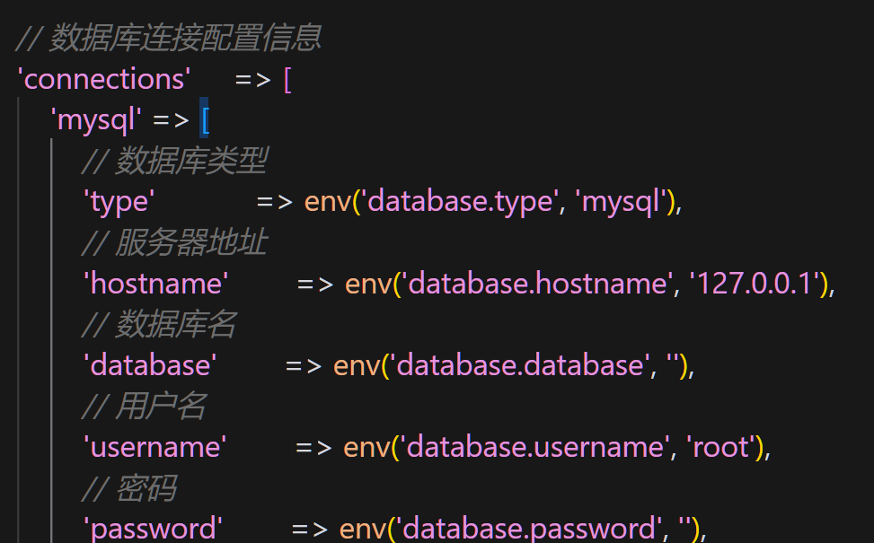

##  安装

1. 安装 composer create-project  topthink/think  PROJECTNAME
2. 运行  php think run [ -p PORT ] 默认 8000

## 开启开发下的调试模式（生产模式关闭）

在 **.env** 进行配置

APP_DEBUG = true


## URL 访问模式

单应用  localhost:8000/控制器/操作
多应用  localhost:8000/应用名/控制器/操作


获取请求参数

```php
//获取控制器名
$this->request->controller();
//获取方法名
$this->request->action();
// 获取参数
$this->request->param();
```

## 数据库连接 和 操作

配置文件  config/database.php




``` php
     $table =  Db::name('t1')->select();
     return $table;

     Db::name('t1')->insert(['name'=>'test1']);
```

查询
-  find  单条查询
-  where('i2',1) -> where('name','like','lily')
- chunk 数据量太大用这个
-  return Db::getLastSql();  返回最后的查询语句


新增
- insert 单条新增


## 模型操作

1. 创建模型

```php
<?php

namespace app\model;

use think\Model;

class T1 extends Model
{
// 定义数据库表
protected $table='demo';
//选择数据库
protected $connection='demo';
}

```

2. 再控制器中使用模型

```php
// 在控制器中

 public function getT1(){
        $where=[];
        $t1=T1::select();
        return json_encode($t1);
    }
```

## 请求

think\Request;